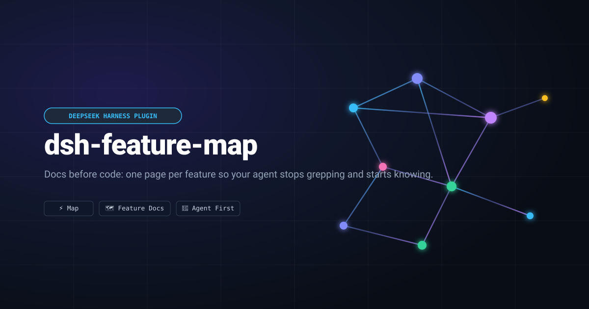

<p align="center">
  
</p>

# dsh-feature-map

A DeepSeek Harness plugin that makes an agent read your project's documentation
before it reads your source.

<div align="center">

[](https://github.com/megablue/dsh-feature-map/actions/workflows/ci.yml)
[](LICENSE)
[](https://github.com/megablue/dsh-feature-map/blob/main/package.json)
[](https://github.com/topics/dsh-plugin)
[](https://dsh-plugin.org/plugins/your-owner/your-plugin-slug)
[](https://github.com/megablue/dsh-feature-map/blob/main/.github/workflows/ci.yml)
[](https://github.com/megablue/dsh-feature-map/blob/main/package.json)

</div>

Finding the code for one area usually means grepping the tree, opening three
files, and working out which parts matter. A feature map replaces that with one
page per feature — the files, types, tests and traps for that area — so the
agent can ask for exactly the piece it needs. `dsh-feature-map` puts that map in
the agent's prompt, gives it five tools to read the map at whatever size the
question deserves, and refuses the first source lookup of a session in a project
that has a map, once, with the reason and the remedy.

It also gets you the map in the first place: `feature_map_init` for a project
that has nothing, `feature_map_adopt` for one that already has documentation, and
`feature_map_regen` for one whose map has outgrown its shape.

## What you get

| Tool | What it does |
| --- | --- |
| `feature_map` | Reads the map: the index, the sections for a topic, one page's shape, one section, one `###`, or the whole page. |
| `feature_map_check` | Reports drift — pages no index row links, rows whose link goes nowhere — and, separately, sections too big to read in one piece. |
| `feature_map_init` | Scaffolds the workflow into a project: `AGENTS.md`, `HANDOFF.md`, `docs/SPEC.md` and the map index. |
| `feature_map_adopt` | Reports what an existing project is missing, and writes only the files that do not exist. |
| `feature_map_regen` | Rewrites an existing map so it reads well: the missing headings and `Status:` lines, every oversized section divided into `###`, and the index reconciled. |

Plus a prompt section that states the read order, and a guard that enforces it
once per session (see *What you will notice*).

## Install

Copy-paste (verified on the `desktop` profile):

    dsh plugin --profile desktop add github:megablue/dsh-feature-map

Or install from source. The plugin is a DSH **bundle**, so it installs from
this directory and takes effect in the running app:

- In the app's plugin settings, add this directory as a bundle.
- Or, if you drive the harness from an agent session, install it with the
  plugin manager pointed at the absolute path of this checkout
  (`…\projects\dsh-feature-map`). It links the package, adds the `feature-map` row to
  the profile, and activates it live.

A **code** change to the plugin itself needs an application restart: the profile
does not watch module files, and toggling the plugin row re-applies the patch
without reloading the module. Editing a *project's* docs needs nothing.

Compatibility & permissions: targets DSH `0.2.0-rc.2`, local workspaces. Reads
`docs/features/` from the host filesystem; writes go through the harness
filesystem seam under the profile's sandbox policy. No dependencies, no peer
dependencies, no network calls.

## Starting a new project

Two steps: get the documents, then fill in the parts only you can answer.

**1. Ask for the scaffold.** Say *"scaffold the documentation workflow here"* —
or name the tool, `feature_map_init`. It returns the four documents rendered for
your project and writes nothing:

| File | What it is for |
| --- | --- |
| `AGENTS.md` | Process and hard rules: the commands, the workflow, the constraints that apply to every change. |
| `docs/features/README.md` | The map index and the page template — the entry point the agent reads first. |
| `docs/SPEC.md` | User-visible behavior, readable without knowing the code. |
| `HANDOFF.md` | Volatile session state: what is in flight, what is next. |

**2. Write them.** Either ask for `feature_map_init` with `write: true` — which
writes through the harness filesystem seam, so the profile's sandbox policy
still applies — or write the returned text yourself. Existing files are never
replaced; pass `force` only when you mean it.

**3. Fill in the marked places.** The documents say what is still a placeholder:
the layout, the commands and the hard rules in `AGENTS.md`, and the first row of
the map index. A scaffolded document that ships unfilled reads as authoritative
and says nothing — the placeholders are visible on purpose.

**4. Write your first page.** Copy the page template out of
`docs/features/README.md` and give it a feature: what it does, the names in it,
how it works, its settings, the tests that pin it, and what it relates to. Then
ask for `feature_map_adopt` — it generates the index row from the page's own
title and `Read when:` line, so you do not hand-maintain the table.

**5. Confirm.** `feature_map_check` should report the map agrees with itself.

From then on the loop is the workflow the documents describe: read the map
before the code, and update the page in the same commit as the change.

## Bringing an existing project

`feature_map_adopt` is read-only unless you pass `apply: true`, and it **never
edits a file that already exists**. What it reports depends on what you have.

### If you already have some form of feature map

Ask for `feature_map_adopt` with no arguments. You get a one-line summary and
five sections:

- **Index** — rows whose link does not resolve, pages no row links, rows with no
  `Read when:` trigger, and the rows to add for anything unlinked.
- **Pages** — which of the six mandated headings each page is missing, which
  pages have no `Status: … Read when:` line, which are not linked.
- **Sections** — every section past the size limit, and whether it *already*
  divides at `###` level or genuinely needs splitting. A long section that is
  already divided is not work, and the report says so.
- **AGENTS.md** — which of the template's blocks your instruction file lacks,
  by name. Your own wording is never touched; you get the missing blocks to
  paste.
- **Outside the map** — markdown under `docs/` that is not a page of the map,
  with its size and section count. Reported, never moved: whether
  `docs/GAME.md` should become a feature page is your call, not the tool's.

Then a **plan**, where every item is labelled `deterministic` (derived from what
is already in your files — the index rows, the missing blocks) or `judgment`
(a `Read when:` trigger, the content of a heading, where a long section splits).
`apply: true` writes only the files that do not exist; everything else is text
for you or your agent to place.

If your map is already in good shape, this is short: it reports the drift, the
oversized sections and the documents outside the map, and stops.

### If your map has outgrown its shape

A map that was written before the workflow existed often reads as one long
section that is too big to hand anyone in one piece. `feature_map_regen` rewrites
it: it adds the missing `##` headings and a `Status: … Read when:` line, divides
every oversized section into `###` chunks that fit a single read, and reconciles
the index with the pages that exist. It changes no prose — the one edit it makes
to a sentence is turning a short bold lead-in into the heading above it — and it
touches nothing outside `docs/features/`.

A chunk it cannot name from your own words is left visibly unnamed:

```
### <!-- chunk 1/2: name this -->
```

so naming them afterwards is a pass over a list in the reply rather than a hunt.
It writes nothing until you pass `apply: true`, and running it twice changes
nothing the second time. Ask for it with `show: true` if you want to read the
result before it is written.

### If you have no feature map

Three cases, and the plugin says which one you are in:

- **You have docs but no map** (say `docs/` with a spec and some notes). The
  report lists those documents as candidates and tells you there are no pages
  yet. The migration is two passes: write your feature pages under
  `docs/features/` first — one page per feature, using the template — then run
  `feature_map_adopt` again and it generates the index from them.
  `feature_map_init` hands you the index and page templates to start from.
- **You have an `AGENTS.md` but no docs.** The report names the instruction
  blocks your `AGENTS.md` is missing and points at `feature_map_init` for the
  map skeleton. `apply: true` writes the map index, `HANDOFF.md` and
  `docs/SPEC.md`, and leaves your `AGENTS.md` exactly as it is.
- **You have nothing** — no docs and no `AGENTS.md`. There is nothing to adopt:
  the reply says so and sends you to `feature_map_init`, which is the *Starting a
  new project* flow above.

Whichever case you are in, the plugin will not rewrite your prose, invent a
`Read when:` trigger, decide what counts as a feature, or move a file. It
measures, proposes, and — when asked — creates what is missing.

## Writing the pages

The map is ordinary markdown that a person can write and review. One page per
feature, with these headings in this order:

```
# <Feature> — <one-line summary>
Status: shipped (vX.Y) · Read when: <the phrase someone would search for>

## What it does      what it is for, in a few bullets
## Map               the files, types, functions and test names — the payload
## How & why         the mechanism, the invariants, the traps
## Config keys / UI  a dense table: key, default, range, where it is set
## Tests that pin it the test names to run first
## Related           links to the other pages
```

Two rules make the map worth reading:

- **Names, never line numbers.** Line numbers rot; a symbol name survives a
  refactor.
- **Keep a section under about two kilobytes**, splitting longer ones with
  `###`. A section is what a later session reads on its own, and one that
  outgrew a single read has to be divided before it can be handed over whole.
  `feature_map_check` names the ones that have.

## What you will notice

In a project that has a map, the **first** `read`, `grep` or `glob` of a session
is refused once:

```
Error: read "src/widgets.js" reads source in a project that keeps a feature
map. Call feature_map first … This is the only time this session will ask;
call read again and it will proceed.
```

That is the whole interruption. It never happens twice in a session, never
happens in a project without a map, and never happens when the agent has already
consulted the map. Reading `docs/`, `AGENTS.md`, `HANDOFF.md` or a `README.md`
is never treated as a source lookup.

If a session is doing something the map does not help with — a large mechanical
refactor, say — set `mode` to `prompt` for the instruction without the guard, or
`off` to silence both.

## Configuration

Set through the plugin's config in your profile.

| Key | Default | What it does |
| --- | --- | --- |
| `mode` | `enforce` | `enforce` denies the first source lookup once; `prompt` keeps the instruction and drops the guard; `off` silences both. An unknown value falls back to `enforce`. |
| `sourceTools` | `read`, `grep`, `glob` | Which tools count as a source lookup. |
| `exemptPaths` | `docs/`, `AGENTS.md`, `CLAUDE.md`, `HANDOFF.md`, `README.md` | Project-relative prefixes that are never a source lookup. |
| `maxBytes` | `12000` | Byte budget for one reply; a capped reply says where to resume. |
| `sectionsPerTopic` | `3` | How many sections a topic reply may carry. |
| `maxSectionBytes` | `2048` | The size a section should be readable in; past it, the checker reports the section. |
| `sectionOrder` | the read tool's slot | Where the instruction sits in the prompt. |

## Where the details live

This README is for using the plugin. The rest is in the repository:

- [`docs/SPEC.md`](docs/SPEC.md) — what a session sees, in full.
- [`docs/features/`](docs/features/README.md) — the feature map for this plugin
  itself: [the map tool](docs/features/map-tool.md),
  [the guard](docs/features/enforcement.md),
  [the boilerplate](docs/features/templates.md),
  [adoption](docs/features/adoption.md),
  [regeneration](docs/features/regen.md),
  [packaging](docs/features/packaging.md).
- [`AGENTS.md`](AGENTS.md) — how to work on the plugin.
- [`HANDOFF.md`](HANDOFF.md) — where things currently stand.
- [`templates/`](templates/) — the boilerplate the plugin hands to a project.

## License

MIT — see [`LICENSE`](LICENSE).
